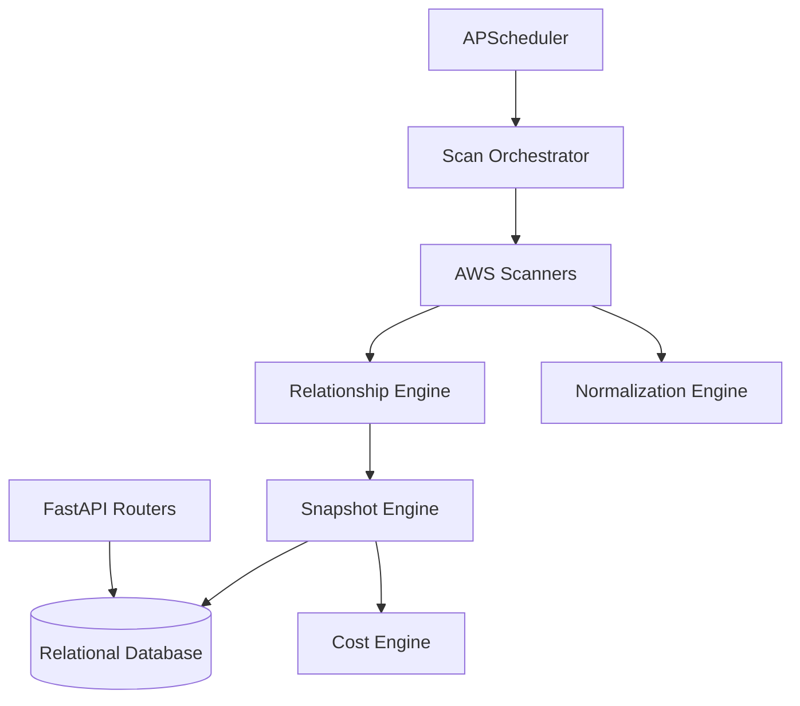

# Backend Architecture Notes

This document provides an in-depth look at the backend implementation of the GravityLens/Nebula-Lens platform. It is intended as the permanent engineering knowledge base and single source of truth for maintainers.

## Purpose and Responsibilities
The backend serves as the core intelligence and data processing layer. It is responsible for:
- Orchestrating multi-region, multi-account AWS scans.
- Normalizing raw AWS API responses into standardized React Flow nodes.
- Discovering hidden communication edges and relationships via IAM, Security Groups, and configuration analysis.
- Maintaining immutable historical snapshots of infrastructure and tracking diffs between them.
- Calculating costs and metrics.
- Exposing REST APIs via FastAPI for the frontend to consume.

## Architecture

The backend is built with **Python 3**, **FastAPI**, and **SQLAlchemy** (PostgreSQL/SQLite). It runs a background scheduler to automatically execute pending scan jobs.

### Directory Structure

- `app/main.py`: Application entry point. Sets up FastAPI, middleware, routes, and the APScheduler.
- `app/database.py`: SQLAlchemy setup and session management.
- `app/models/models.py`: SQLAlchemy ORM definitions for tables (Users, AwsAccounts, Snapshots, Resources, etc.).
- `app/schemas/`: Pydantic models for API request/response validation.
- `app/routers/`: FastAPI endpoint controllers (e.g., `graph.py`, `aws_accounts.py`).
- `app/scanners/`: Boto3 integration modules for specific AWS services.
- `app/engines/`: The core business logic (Orchestrator, Normalizer, Relationship, Snapshot, Cost, Metrics).
- `app/services/`: External integrations (e.g., `aws_service.py` for STS AssumeRole).

## Request Lifecycle (Scan Execution)

The most complex and important flow in the backend is the scan execution process.

1. **Trigger**: A scan is queued manually via an API route or automatically. `apscheduler` picks up jobs in the `pending` state every 5 minutes and calls `scan_orchestrator.run_scan(job_id)`.
2. **Authentication**: The orchestrator assumes the IAM role specified in the AWS Account configuration via `aws_service._get_temp_credentials()`.
3. **Scanning**: For each configured region (and globally for services like S3/CloudFront), the orchestrator invokes specific scanners (e.g., `vpc_scanner.scan`, `ec2_scanner.scan`).
4. **Normalization**: Each scanner uses boto3 to fetch raw data. Before returning, it passes the data to `NormalizationEngine`, which builds a standard node dictionary (`id`, `type`, `data`) and generates a SHA256 `fingerprint` of the resource's metrics.
5. **Relationship Discovery**: All discovered nodes are fed into the `RelationshipEngine`, which infers communication edges (e.g., Lambda invokes SQS) based on IAM permissions, environment variables, Security Group overlap, and other heuristics.
6. **Cost Calculation**: The `SnapshotEngine` receives the complete graph (nodes + edges) and calls the `cost_engine` to pre-calculate monthly costs for each resource.
7. **Snapshot & Diffs**: The `SnapshotEngine` creates a new immutable `Snapshot` record. It persists the nodes as `Resource` records and edges as `Relationship` records. It then compares the new resources with the previous snapshot (using the `fingerprint`) to generate `SnapshotDiff` records (added, removed, modified).

## Important Engines and Modules

### `ScanOrchestrator` (`app/engines/scan_orchestrator.py`)
Coordinates the entire scanning process. It handles regional vs. global service scanning and catches exceptions from individual scanners to allow partial successes.

### `NormalizationEngine` (`app/engines/normalizer.py`)
Converts raw AWS JSON responses into standard graph nodes.
**Design Decision**: It generates a `fingerprint` (SHA256 hash) of the critical metrics. This allows the system to easily detect if a resource's configuration has changed between scans without deep-comparing JSON.

### `RelationshipEngine` (`app/engines/relationship_engine.py`)
The most sophisticated part of the backend. It uses multiple passes to discover edges:
- **Confidence 100**: Direct configuration links (e.g., API Gateway Integration URI pointing to Lambda, EventBridge rules).
- **Confidence 90-95 (Pass 2)**: Rule-based heuristic extraction defined in `PASS_2_RULES` (e.g., ALB routing to target groups).
- **Confidence 80**: IAM permission analysis. It parses IAM policies (managed and inline) associated with roles to determine if a Lambda or EC2 instance has permission to access an S3 bucket, SQS queue, RDS database, etc. Results are cached to avoid rate-limiting.
- **Confidence 70**: Security Group intersection (e.g., matching EC2 outbound rules to RDS inbound rules).

### `SnapshotEngine` (`app/engines/snapshot_engine.py`)
Responsible for persistence and diff generation.
**Internal Algorithm**: Diff generation operates by comparing the current scan's resources against the `last_snapshot` resources.
- Resources present in the new scan but not the old are `added`.
- Resources in the old scan but not the new are `removed`.
- Resources in both scans but with mismatched `fingerprint` values are `modified`.

## Data Models

Important database models (`app/models/models.py`):
- `AwsAccount`: Holds the STS Role ARN used for scanning.
- `ScanJob` & `ServiceScan`: Track the status and progress of scans.
- `Snapshot`: Represents an immutable point-in-time version of the infrastructure graph.
- `Resource` & `Relationship`: The actual nodes and edges tied to a specific snapshot. They use React Flow terminology (`node_type`, `edge_type`) for direct frontend compatibility.
- `SnapshotDiff`: Stores granular changes between snapshots.

## Design Decisions

- **React Flow Coupling**: The backend normalizer outputs data directly formatted for React Flow. This tightly couples the backend to the frontend visualization library but eliminates the need for a complex transformation layer in the frontend.
- **Immutable Snapshots**: Instead of mutating a live representation of the infrastructure, each scan creates a full new graph. This requires more storage but enables powerful time-travel debugging and architectural history tracking.
- **Assume Role Architecture**: The system requires cross-account IAM roles rather than storing static AWS access keys, following security best practices.

## Error Handling and Edge Cases

- **Scanner Failures**: If an individual scanner (e.g., ECS) fails due to missing permissions or API errors, the `ScanOrchestrator` catches the exception, logs it in `ServiceScan`, and marks the overall job as `partial` rather than completely failing it. This ensures that a missing permission for one service doesn't break the entire graph.
- **Throttling**: Heavily relies on IAM caching inside the `RelationshipEngine` to avoid `ThrottlingException` from the AWS IAM API when analyzing many roles.

## Performance Considerations

- **Diff Computation**: Calculating diffs happens in memory before writing to the database using hashed fingerprints. This is O(N) where N is the number of resources, avoiding O(N^2) cross-comparisons.
- **Database Connection Pooling**: SQLAlchemy is configured with a connection pool size of 20 and a max overflow of 30 to handle parallel scanning and API requests smoothly.

## Technical Debt and Future Improvements

- **Pagination**: Currently, many boto3 scanner implementations may lack robust pagination for accounts with massive amounts of resources, which could lead to missed nodes.
- **Memory Consumption**: The `SnapshotEngine` loads all nodes and edges into memory during the diff phase. For extremely large AWS environments (10,000+ resources), this may cause memory spikes and could be optimized to stream processing or chunked DB writes.
- **Region Hardcoding**: The orchestrator currently iterates over a hardcoded list of `SCAN_REGIONS`. This should be driven by configuration or dynamic AWS Region discovery.
